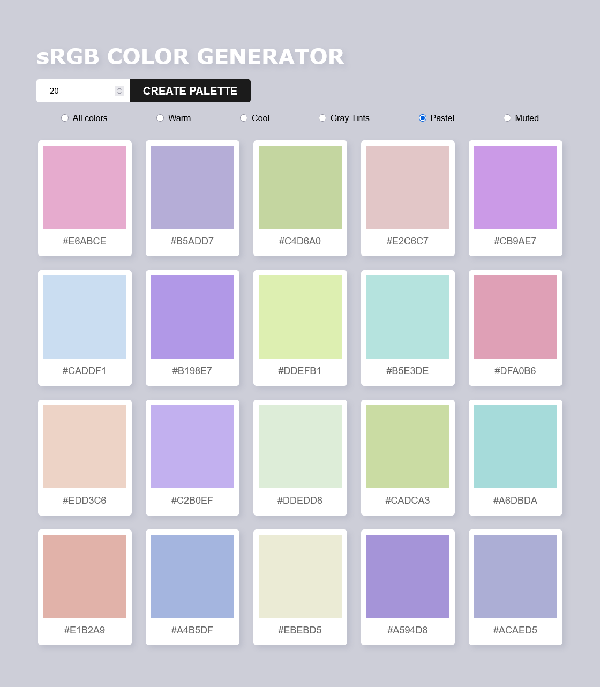

# sRGB random Generator
Using JavaScript, HTML and CSS
- you can generate random palettes, with your desired number of colors (between 1 and 50)
- you can copy each hexCode to save your fav colors
- now you can also chose between random sRGB, or bye HSL hues!

